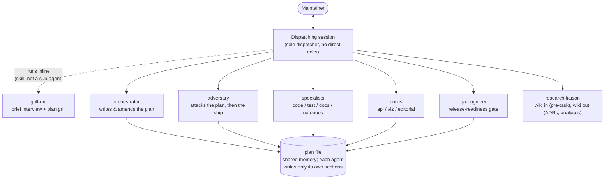
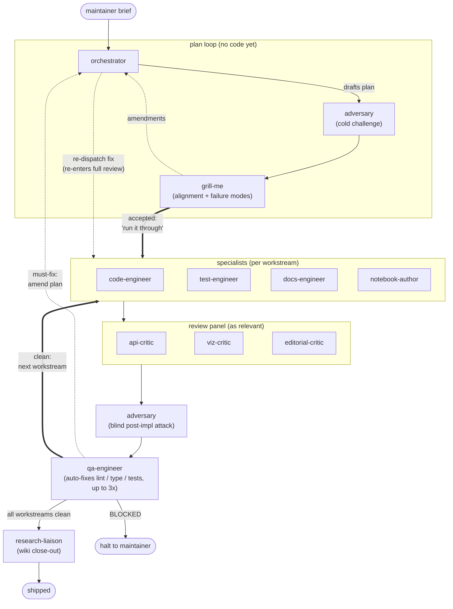

# hiveplotlib-agent-harness

Building an agent harness to improve agentic independence on Hiveplotlib software development and research.

Intended use: a submodule of Hiveplotlib used in correspondence with an adjacent [Hiveplotlib LLM Wiki](https://github.com/gjkoplik/hiveplotlib-llm-wiki) submodule.

## How it works

The dispatching session (the consumer-repo Claude Code conversation the maintainer types into) is the sole dispatcher: every sub-agent is invoked from it, sub-agents never invoke each other, and every report returns to it for the maintainer to see. The plan file is the shared memory the agents coordinate through.

Rough order for a coding task: grill-me brief interview (optional) → research-liaison pre-task → orchestrator plans → adversary challenges → grill-me grills → per workstream: specialist → critics → adversary post-impl → qa-engineer → research-liaison closes out to the wiki. A research run swaps the specialists for a bounded panel of parallel research lenses, with the same adversary/grill spine.

### The build loop (autonomous coding)

How code actually gets built: a generate-evaluate loop (the evaluator-optimizer shape from Anthropic's *Building Effective Agents*, with the roles split further). A plan-hardening loop runs before any code exists; then each workstream flows specialists → reviewers, with the two big loops drawn as back-edges: `must-fix` findings route back through the orchestrator for amend-and-re-dispatch (drawn once from qa to keep the diagram clean; a `must-fix` from any reviewer takes the same edge), and a clean workstream cycles to the next until the plan is done (qa also has a self-fix micro-loop, noted in its box). Within a workstream the session dispatches the relevant specialists in order (test-engineer follows code-engineer) and only the reviewers the surface calls for. Under auto-dispatch ("run it through") the pauses between workstreams are removed but every gate still runs; the run halts to the maintainer on `must-fix`, `BLOCKED`, or a finding that bears on a downstream workstream.

Arrows show the logical hand-off order; physically, every dispatch is made by the dispatching session (the hub above), which is how each agent keeps a clean context.

The full call-order detail — gates, checkpoints, finding-routing, and the research-run grounding rules — is diagrammed in [diagrams.md](diagrams.md).
