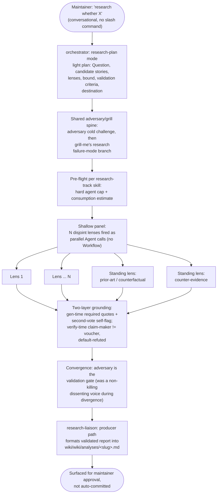

# Harness flow diagrams

Detailed records of how and when the dispatching session invokes each agent and gate. For the compact at-a-glance view of the agent topology, see the [README](README.md).

## Coding task flow

```mermaid
flowchart TD
    brief([Maintainer brief, non-trivial]) --> gate{"Brief-mode gate:<br/>brief underdetermines<br/>plan-shaping choices?"}
    gate -- "yes (or maintainer invokes)" --> grillbrief["grill-me: brief mode<br/>(extraction interview,<br/>one question at a time)"]
    gate -- "knowingly skipped<br/>(recorded in plan Goal)" --> liaison
    grillbrief --> liaison["research-liaison: pre-task<br/>(search wiki for prior<br/>ADRs / design docs)"]
    liaison --> orch["orchestrator: initial-plan<br/>writes wiki/wiki/plans/&lt;topic&gt;.md"]
    orch --> advpre["adversary: planning mode<br/>cold pre-grill challenge<br/>(did-not-author read)"]
    advpre --> exist{"self-tagged<br/>existential-must-fix?"}
    exist -- yes --> checkpoint["Dispatching session surfaces<br/>reconsider-before-grilling<br/>checkpoint"]
    checkpoint -- abort --> dead([Plan abandoned])
    checkpoint -- continue --> grill
    exist -- no --> grill["grill-me: post-plan grill<br/>(waves high to low, incl.<br/>failure-mode wave that names<br/>the Failure modes rubric)"]
    grill --> newmodes{"grill named modes<br/>the cold pass<br/>didn't cover?"}
    newmodes -- yes --> rubricheck["adversary: post-grill<br/>rubric-check (delta only)"]
    newmodes -- "no (clean)" --> accept
    rubricheck --> accept["Plan accepted<br/>(optional 'run it through'<br/>= auto-dispatch, pauses removed,<br/>gates intact)"]
    accept --> ws["Workstream specialist:<br/>code-engineer / test-engineer /<br/>docs-engineer / notebook-author"]
    ws --> critics["Conditional post-impl critics:<br/>api-critic (user-facing API)<br/>viz-critic (figures)<br/>editorial-critic (notebooks)"]
    critics --> advpost["adversary: post-impl<br/>(blind attack on diff first,<br/>then reconcile via<br/>two-message dispatch)"]
    advpost --> qa["qa-engineer: tests, lint, type,<br/>doc build, audit.sh, security/perf<br/>trip-wires, Implementation log,<br/>CHANGELOG"]
    qa --> findings{"Findings from critics,<br/>adversary, or qa?"}
    findings -- must-fix --> amend["orchestrator: amend-plan"]
    amend --> ws
    findings -- worth-discussing --> wd["Maintainer-gated at checkpoint<br/>(auto-routes only if it bears on<br/>a downstream workstream;<br/>batches to plan-end under<br/>auto-dispatch)"]
    wd --> more
    findings -- pass --> more{More workstreams?}
    more -- yes --> ws
    more -- no --> adr["qa-engineer surfaces<br/>ADR-promotion worth-discussing"]
    adr --> liaison2["research-liaison: post-task<br/>(entity page + log.md;<br/>ADR promotion on green-light)"]
    liaison2 --> done([Plan ships, moves to plans/archived/])
```

Simplifications in the diagram: finding-routing from the three critics, the adversary, and qa is merged into one decision node (in practice each surfaces its own report, and a `must-fix` routes to `amend-plan` from any of them), and the qa-engineer backstop is not drawn (a still-`Pending` critic section flags `must-fix` and forces the missing critic to run).

## Research run flow

